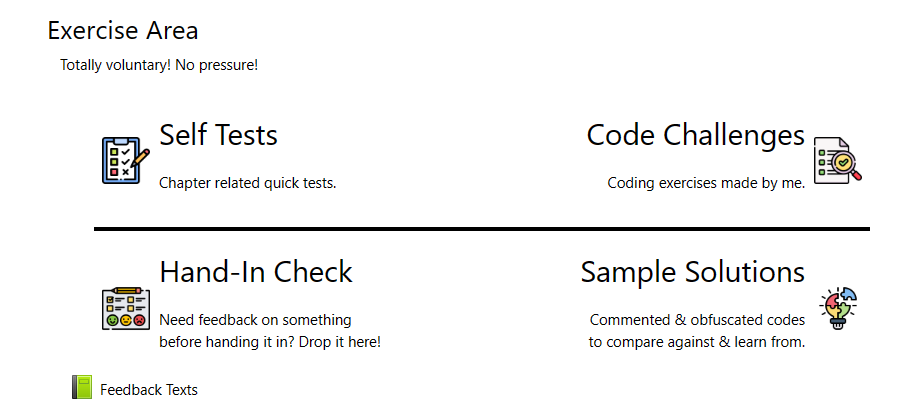
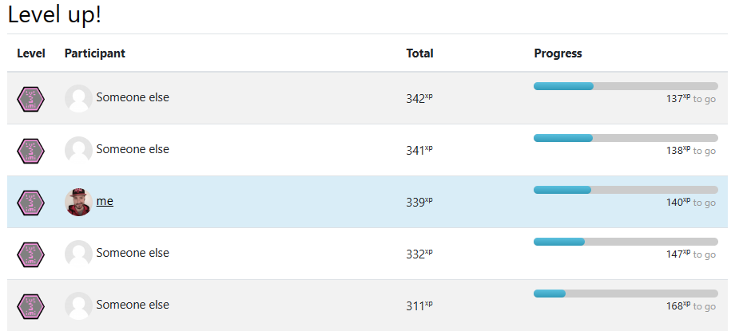
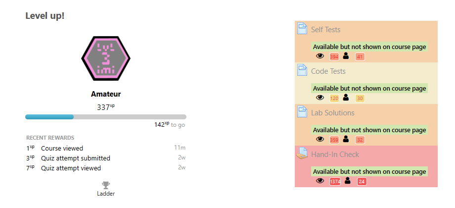
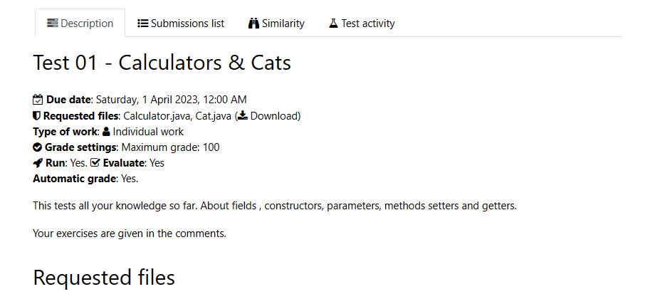

# GamifiedMoodle
I got my own Moodle coruses from my university to use for tutoring.
So I decided to use it to test and expand my didactic capabilities.

## Improved Design

To foster more interest in the voluntary tutorial course, a better design was needed. Instead of the simple, rather bland button lists I hid everything behind an additional layer of web-design. As I had no admin rights to change the Moodle looks on server-side directly, I had to come up with ideas to achieve this with built-in tools instead: Labels proved to be excelent for that. The ones shown below were just a tiny speck of all the ones available in the end.

## Gamification Tools

Our moodle turned out to include the XP+ plugin. This gave me an idea to incentivise interaction, as alsost any action would yield XP points and levels. That way everyone could anonymously compare their progress with others, and also some sections would open up at certain levels only.

## Data Evaluation

The level system got me some data on how individual students developed in general and which sections they utilized. The built-in heatmap plugin helped analyze popular sections even further.

Depending on which semester (the 1st or 2nd) I thought the data looked certainly different - some were expected, some other results sure were surprising. This was a valuable insight! For the time being, future courses and hopefully my bachelors thesis.

## Using VirtualProgrammingLabs

A rather unknown module was the VPL, about even most of our professors never heard of or even used it. Which is a shame, as it is powerful!

It took me a bit to figure out how to set the labs up properly, but once I got it, I was able to provide new coding challenges to test and improve teaching on the lecture's topics.